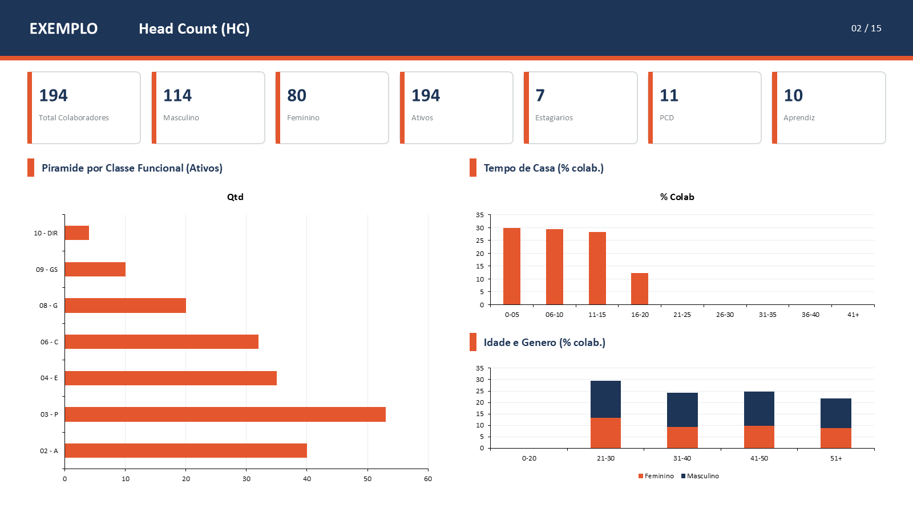
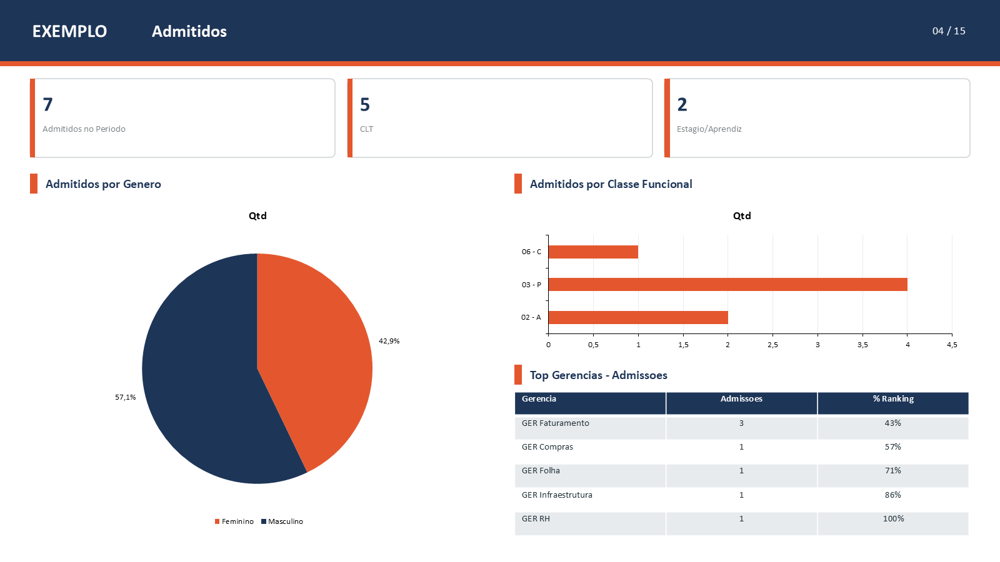
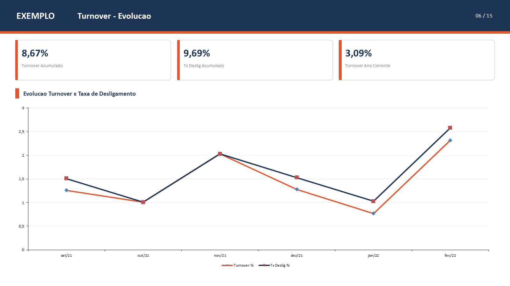

# 📊 Excel → PowerPoint: gerador de apresentação de indicadores

Motor que transforma **dados brutos de uma planilha** numa **apresentação PowerPoint pronta**, com KPIs calculados e **gráficos nativos editáveis**. Neste exemplo, gera os 15 slides de indicadores de Recursos Humanos de uma empresa fictícia.

| Capa | Head Count |
|---|---|
|  |  |
|  |  |

## O problema

Todo mês a equipe de RH montava a apresentação de indicadores à mão: exportava dados, calculava turnover, headcount, pirâmide etária e custos em planilhas paralelas, depois copiava e colava gráficos no PowerPoint. Eram horas de trabalho repetitivo e sujeito a erro.

## A solução

A pessoa **não digita indicadores prontos**. Ela cola os dados brutos (uma linha por colaborador, mais os lançamentos financeiros), escolhe o período e roda um comando:

```
Modelo_Dados_RH.xlsx   ← preenchido com dados brutos
        │
        ▼
hr_deck/periodo.py     resolve Mensal / Semestral / Anual
hr_deck/dados.py       CALCULA os indicadores (HC, turnover, span, pirâmide…)
hr_deck/spec.py        layout declarativo: posição e tipo de cada bloco
hr_deck/brand.py       identidade visual (cores, fonte, logos)
        │
        ▼
gerar_apresentacao.py  renderiza: capa, cabeçalhos, KPIs, tabelas, gráficos
        │
        ▼
Apresentacao_RH.pptx
```

### Decisões de projeto

- **Layout spec-driven**: cada slide é uma lista de blocos `{título, render, pos}`. Trocar um gráfico de coluna por pizza, ou mover um bloco, é uma linha no `spec.py`, sem tocar no código de desenho.
- **Gráficos nativos do PowerPoint**, não imagens: quem recebe pode editar dados, cores e rótulos.
- **Cálculo separado do desenho**: `dados.py` só devolve números; `gerar_apresentacao.py` só desenha. Cada indicador fica numa função testável (`s03_hc`, `s06_turnover`…).
- **Tolerante a dado faltando**: sem a aba de colaboradores, os slides dependentes ficam vazios com aviso, mas a geração não quebra.
- **Marca configurável**: nome da empresa, paleta e imagens ficam no `brand.py`. Sem imagens, o gerador usa fundos sólidos e o nome em texto.
- **Planilha-modelo gerada por código**, com validação de dados (listas suspensas), aba "Leia-me" e 220 colaboradores fictícios para ver o resultado antes de usar dados reais.

### Indicadores calculados

- **Retrato do fim do período**: headcount, gênero, pirâmide por nível, tempo de casa, idade, span de controle, PCD, raça e gênero, liderança
- **Fluxo no período**: admitidos, desligados (voluntários e involuntários), turnover, pareto por gerência
- **Evolução mensal**: headcount, admissões × desligamentos, turnover, custo rescisório
- **Financeiro**: horas extras, sobreaviso e custo rescisório por negócio

## Como rodar

```bash
pip install -r requirements.txt
python gerar_modelo_excel.py          # cria Modelo_Dados_RH.xlsx com dados fictícios
python gerar_apresentacao.py          # gera Apresentacao_RH.pptx
python gerar_apresentacao.py dados.xlsx saida.pptx   # nomes personalizados
```

## Testes

```bash
pip install -r requirements-dev.txt
pytest -v
```

O teste ponta a ponta gera a planilha, calcula os indicadores, monta o `.pptx` e confere o número de slides e se os gráficos são nativos.

## Contexto

Projeto pessoal inspirado num problema real e comum em áreas de RH: o relatório mensal de indicadores montado à mão. Toda a base de exemplo é fictícia (gerada com semente fixa), e a identidade visual é neutra e configurável.

## Stack

Python · python-pptx · openpyxl · pytest
